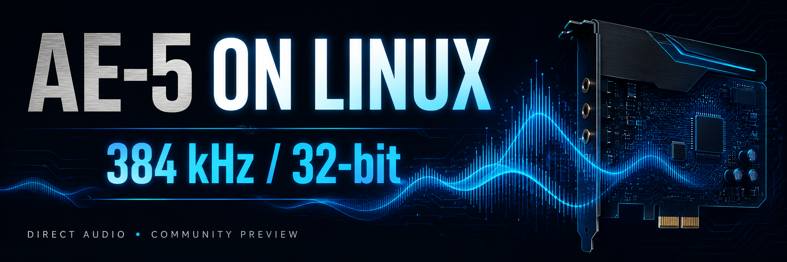

<!--
FIRST-PARTY DEVELOPMENT CONTEXT
Owner / operator: Kyle Monti, Aegiris Systems
Route: none
Scope: Public installation, recovery history and release documentation for AE-5 Linux. Published in this repository, with no Linear write.
Activity: ordinary software development, driver packaging and control-panel implementation.
Terminology: Direct PCM is stereo playback at 384000 Hz in S32_LE, a 32-bit sample container rather than measured analog precision.
Projects in scope: ae5-linux and AegAudio.
Out of scope: automatic changes to working systems, other cards, private configurations, signing keys and Creative binary redistribution.
-->



# AE-5 on Linux

**384 kHz / 32-bit stereo Direct playback, with an independent Linux control panel inspired by Sound Blaster Command.**

Created by **Kyle Monti / Aegiris Systems**, building on the Linux CA0132 driver and its upstream contributors. This project packages the native Direct-path work recovered on Kyle's Sound BlasterX AE-5, plus AegAudio's browser and native desktop interfaces.

[Download the complete bundle](https://github.com/AegirisSystems/ae5-linux/releases/download/v0.16.0-preview2/ae5-linux-v0.16.0-preview2-bundle.tar.gz) · [Release and checksums](https://github.com/AegirisSystems/ae5-linux/releases/tag/v0.16.0-preview2) · [Installation](#installation) · [The 96 kHz ceiling](#why-96-khz-was-the-ceiling) · [Kyle's recovery](#what-kyle-did-to-recover-the-audio)

> **Experimental preview, with one recovered hardware system.** Kyle reported audible Direct playback at 384000 Hz / S32_LE. The browser panel has been deployed and its reads and automatic refresh verified. The redistributed driver/integration package has been compiled and inspected, but has not completed a clean installation, reboot, suspend or playback qualification on another machine. This is not a universal Linux installer or a claim of complete Windows feature parity.

## What you get

| Component | Included capability |
| --- | --- |
| Native CA0132 kernel module | AE-5 Direct stereo transport, clock and DAC path for the qualified hardware/kernel |
| Direct service and configurator | Device/account discovery, explicit activation, runtime PipeWire integration and restoration checks |
| AegAudio browser panel 0.2.0 | Command-style navigation, acoustic dials, graphical EQ, playback, recording, mixer, profiles and listening history |
| Live control synchronization | Changes submit on release/selection; visible idle pages read back external changes roughly once per second |
| Native Qt panel 0.2.0 | Desktop alternative with explicit Apply/Refresh and authorized Direct service actions |
| Installation bundle | Driver Debian package, UI wheel, source, banner, guides, provenance manifest and checksums |

The browser panel accepts only the qualified **AE-5** identity. It has no X-Fi or Focusrite control page. Neither device, ASIO nor a second computer is required for AE-5 playback. The current **Direct lifecycle service still depends on PipeWeaver**; installing only the browser panel does not.

## Why 96 kHz was the ceiling

Creative documents the AE-5's higher rate in **Direct / Direct HP mode**. The normal DSP playback path and the Direct path have different capabilities. [Creative technical specifications](https://support.creative.com/kb/ShowArticle.aspx?c=&sid=138952), [Creative high-resolution setup](https://support.creative.com/kb/ShowArticle.aspx?c=&sid=200007).

The September 2026 investigation found three separate software constraints:

1. **The selected Linux playback endpoint exposed at most 96000 Hz.** On the recovered machine, HDA converter node `0x02` advertised rates through 96 kHz and 16/24-bit samples. ALSA playback was stereo `S32_LE` at 96000 Hz even when the PipeWire graph requested 192000 and its allowed-rate list included 384000. A graph setting does not establish the hardware stream's rate.
2. **The ordinary CA0132 path used the DSP's 96 kHz routing.** It did not supply this AE-5 Direct transition. Turning effects off in a mixer did not configure a different transport, clock and DAC path. See the [inspected upstream CA0132 implementation](https://github.com/torvalds/linux/blob/59a2cd69b44007fa59566bc52da107fc2b814cf0/sound/hda/codecs/ca0132.c).
3. **The inspected generic HDA format code stopped at 192 kHz.** Its rate table explicitly noted that 384 kHz was not properly supported. That is a limitation of this code path, not every Linux audio device. See the [pinned HDA format implementation](https://github.com/torvalds/linux/blob/59a2cd69b44007fa59566bc52da107fc2b814cf0/sound/hda/core/device.c#L702-L797).

No license switch, encrypted unlock or deliberate vendor restriction was established. The evidence pointed to missing mode support and device-specific programming. These findings describe the inspected driver revision and recovered endpoint, not every past or future Linux release.

The [captured Front converter capability block](docs/evidence/ae5-front-capability.txt) preserves the original 96 kHz endpoint report without publishing the machine's complete audio configuration.

### What the native driver changes

Static inspection of the supplied Windows package identified the AE-5's packed transport representation. At the same 32-bit word size:

```text
384000 frames/second × 2 audio channels
192000 frames/second × 4 transport slots
                     = the same payload rate
```

The Linux implementation exposes stereo `S32_LE` at 96, 192 and 384 kHz when its managed Direct path is enabled. For 384 kHz it constructs a four-slot / 192 kHz HDA transport, then programs the AE-5's routing and clocks for the stereo Direct path. This is not four-speaker playback, and it does not merely change a maximum-rate label.

The relevant source is public:

- [`driver/ae5_native.c`](driver/ae5_native.c): `enable_pcm()` and `pcm_prepare()`, including supported formats, callbacks and packed transport.
- [`driver/ae5_direct_route_cycle.c`](driver/ae5_direct_route_cycle.c): Direct transport setup and readback.
- [`driver/ae5_path_cycle.c`](driver/ae5_path_cycle.c): output path and clock changes.
- [`driver/ae5_dac_volume.c`](driver/ae5_dac_volume.c): DAC volume handling for the Direct path.
- [`integration/ae5_service.py`](integration/ae5_service.py): lifecycle, routing prerequisites, restoration and Front DAC mute checks.

The service selects 384 kHz; the additional driver rates are not a tested user-selectable mode matrix. Windows drivers are not executed on Linux, and this package contains no Creative Windows binaries.

## What Kyle did to recover the audio

Kyle initiated the investigation because the same AE-5 and headphones no longer sounded or behaved as they had under Windows. He supplied the Windows installer for interoperability analysis, insisted that the actual hardware path be traced, and directed the clean-configuration diagnosis when repeated routing changes failed.

**Kyle found the final cause of total silence himself: `Front Playback Switch` was off.** The Direct stream was already reporting 384 kHz, DMA was running, and the pins were enabled. DAC node `0x02` still reported amp byte `0xc3`: mute bit `0x80` set over level `0x43`. Clearing that mute restored the missing output. A healthy software graph had not proved that the physical output was audible.

That was a separate problem from the 96 kHz ceiling. The driver work supplied the high-rate path; Kyle's mute discovery recovered sound from that path. It would be inaccurate to say that unmuting alone unlocked 384 kHz, or that a 384 kHz status line alone proved the recovery.

The resulting package checks the actual Front DAC mute bits during activation/restoration, explicitly handles Front playback, and preserves the user's existing gain and levels. The recovered setup also needed a missing PipeWeaver user service and persistent user routing files rather than routing that lived only under `/run`. The configurator supplies the missing unit where needed; each user must configure their own routes. Kyle's private mixer state, account identifiers and full machine snapshot are not shipped.

## Compatibility and limits

| Requirement | This preview |
| --- | --- |
| Card | Sound BlasterX AE-5, codec `0x11020011`, subsystem `0x11020051` |
| Kernel package | **7.0.0-31-generic only**, built against its matching Ubuntu headers |
| Architecture | x86-64 / Debian `amd64` |
| Recovered environment | Ubuntu 26.04 with PipeWire, WirePlumber and PipeWeaver |
| Python | 3.10 or newer |
| Direct integration | systemd user audio services, PipeWeaver daemon/client and local API on port 14565 |
| Desktop account | Non-root account; current service assumes the primary GID equals the UID |
| Firmware | ALSA `ctefx-desktop.bin` |
| Secure Boot | Module is unsigned; use your own enrolled signing key if enabled |
| Output used for recovery | AE-5's dedicated rear headphone jack |

Other kernels, AE-5 Plus subsystem variants, other AE-series cards and other distributions are not qualified. This is not DKMS: a kernel upgrade does not automatically rebuild or validate this module. Do not force-load it into a different kernel.

`384 kHz / 32-bit` describes the Direct PCM mode. It does not mean 32 bits of measured analog resolution, eliminate electrical noise, add information to lower-rate music, or certify that every source reaches the DAC without resampling. The banner states the mode, not an analog measurement result.

## Download

Use **v0.16.0-preview2** for the browser panel and the complete instructions on this page. The earlier preview1 contains the older native-only UI wheel.

| File | Purpose |
| --- | --- |
| [`ae5-linux-v0.16.0-preview2-bundle.tar.gz`](https://github.com/AegirisSystems/ae5-linux/releases/download/v0.16.0-preview2/ae5-linux-v0.16.0-preview2-bundle.tar.gz) | Everything maintained by this project in one archive |
| [`ae5-direct-driver_0.16-1_amd64.deb`](https://github.com/AegirisSystems/ae5-linux/releases/download/v0.16.0-preview2/ae5-direct-driver_0.16-1_amd64.deb) | Exact-kernel driver and lifecycle integration; byte-identical to preview1 |
| [`aegaudio-0.2.0-py3-none-any.whl`](https://github.com/AegirisSystems/ae5-linux/releases/download/v0.16.0-preview2/aegaudio-0.2.0-py3-none-any.whl) | Browser and native panels |
| [`bundle-manifest.json`](https://github.com/AegirisSystems/ae5-linux/releases/download/v0.16.0-preview2/bundle-manifest.json) | Source commit, component identities and validation limits |
| [`SHA256SUMS`](https://github.com/AegirisSystems/ae5-linux/releases/download/v0.16.0-preview2/SHA256SUMS) | Release asset checksums |

Linux terminal, in a new download directory:

```sh
mkdir -p ~/Downloads/ae5-preview2
cd ~/Downloads/ae5-preview2
curl --fail --location --remote-name https://github.com/AegirisSystems/ae5-linux/releases/download/v0.16.0-preview2/ae5-linux-v0.16.0-preview2-bundle.tar.gz
curl --fail --location --remote-name https://github.com/AegirisSystems/ae5-linux/releases/download/v0.16.0-preview2/SHA256SUMS
grep '  ae5-linux-v0.16.0-preview2-bundle.tar.gz$' SHA256SUMS > bundle.sha256
sha256sum --check bundle.sha256
tar -xzf ae5-linux-v0.16.0-preview2-bundle.tar.gz
cd ae5-linux-v0.16.0-preview2
sha256sum --check SHA256SUMS
```

Continue only if both checksum checks pass. The archive contains this README and source tree at its root, with the driver and wheel under `packages/`. It does not contain kernel headers, distribution dependencies, PySide6, firmware or PipeWeaver; those are installed separately. Checksums detect changed bytes, not an independent signature of the publisher.

## Installation

Choose one path:

- **Audio already works and you only want the panel:** follow step 1 below. Stop there; no driver replacement is needed.
- **You want the experimental 384 kHz driver:** download/extract the bundle, then follow steps 2 through 7 on the compatible Linux machine. Step 1 is optional for its UI.

### 1. Install only the control panel

From the extracted bundle, as your normal desktop user:

```sh
sudo apt install python3 python3-venv alsa-utils
python3 -m venv ~/.local/share/aegaudio-0.2.0
~/.local/share/aegaudio-0.2.0/bin/pip install --no-deps ./packages/aegaudio-0.2.0-py3-none-any.whl
~/.local/share/aegaudio-0.2.0/bin/aegaudio-web --host 127.0.0.1 --port 8770
```

Open **http://127.0.0.1:8770/** on that Linux machine. The browser server uses Python's standard library; `--no-deps` avoids downloading Qt for a browser-only install. Leave the terminal running; Ctrl+C stops only this web server. If port 8770 is already occupied by your existing panel, use another port for a trial instead of killing an unknown process.

For the native desktop panel, add its Qt dependency to the same environment:

```sh
~/.local/share/aegaudio-0.2.0/bin/pip install 'PySide6>=6.8,<7'
~/.local/share/aegaudio-0.2.0/bin/aegaudio
```

Neither panel should run as root. The browser reads current settings on startup without applying a saved profile. Dials/sliders submit on release, switches/dropdowns on change, and background readback refreshes about once per second while visible and idle. The native panel uses explicit Apply and Refresh.

For another computer to view the browser panel, bind `--host` to the Linux machine's chosen private LAN IP and open `http://THAT_IP:8770/`. This preview has **no login or TLS**. Keep it on a trusted private network; its session token and same-origin checks are not network authentication. Do not forward the port to the internet. See [web operation](docs/WEB.md).

### 2. Check the target and make a backup

These are read-only identification commands:

```sh
uname -r
uname -m
id -u
id -g
cat /proc/asound/cards
grep -H -E 'Codec:|Vendor Id:|Subsystem Id:' /proc/asound/card*/codec\#*
```

The kernel must be `7.0.0-31-generic`, architecture `x86_64`, and the selected card must match both codec and subsystem above. The two numeric account IDs must match for this integration preview. Do not assume the AE-5 is card 4; card numbers can change between boots.

Keep the distribution's stock module. The package installs its module under `updates/ae5`; it does not delete the stock module. Before driver installation, save your own ALSA state and relevant audio configuration:

```sh
AE5_BACKUP="$HOME/ae5-backup-$(date +%Y%m%d-%H%M%S)"
mkdir -m 700 "$AE5_BACKUP"
sudo alsactl -f "$AE5_BACKUP/asound.state" store
python3 - "$AE5_BACKUP" <<'PY'
import pathlib, sys, tarfile
home = pathlib.Path.home()
paths = ['.config/pipewire', '.config/wireplumber', '.config/pipeweaver',
         '.local/state/wireplumber', '.local/share/pipeweaver',
         '.config/systemd/user', '.asoundrc', '.config/pulse']
with tarfile.open(pathlib.Path(sys.argv[1]) / 'user-audio-config.tar.gz', 'w:gz') as archive:
    for name in paths:
        path = home / name
        if path.exists() or path.is_symlink():
            archive.add(path, arcname=name)
print('Backup:', sys.argv[1])
PY
```

Also preserve custom system audio overrides in `/etc/pipewire`, `/etc/wireplumber`, `/etc/asound.conf`, `/etc/modprobe.d` and existing AE-5 systemd units if you use them. This is a configuration backup, not a disk image. Keep it private and never restore somebody else's gain/volume state onto your card.

### 3. Install the driver package and desktop firmware

From the bundle root:

```sh
sudo apt install ./packages/ae5-direct-driver_0.16-1_amd64.deb
```

Package installation runs `depmod` and reloads systemd unit definitions. **It does not reload the card or start Direct audio.** The package version is 0.16-1; the recovered native implementation remains 0.15. Preview2 reuses preview1's exact driver package because this update changes documentation and the panel, not driver behavior.

Prefer your distribution's ALSA desktop firmware package if it supplies `/usr/lib/firmware/ctefx-desktop.bin` or its supported compressed form. If it does not, get the [official ALSA firmware 1.2.4 archive](https://www.alsa-project.org/files/pub/firmware/alsa-firmware-1.2.4.tar.bz2):

```sh
curl --fail --location --remote-name https://www.alsa-project.org/files/pub/firmware/alsa-firmware-1.2.4.tar.bz2
printf '%s\n' 'c9ab092e5717080bcd90971d44aa7d8d30778058ea691dda76320cd315dcc18e  alsa-firmware-1.2.4.tar.bz2' | sha256sum --check -
tar -xjf alsa-firmware-1.2.4.tar.bz2
```

After verifying the archive, inspect its license and `alsa-firmware-1.2.4/ca0132/ctefx-desktop.bin`. If the destination is absent, install it with:

```sh
sudo install -m 0644 alsa-firmware-1.2.4/ca0132/ctefx-desktop.bin /usr/lib/firmware/ctefx-desktop.bin
```

Back up an existing firmware file before choosing to replace it. Do not substitute a Windows firmware blob. The firmware is obtained from ALSA and is not included in this bundle.

### 4. Sign the module if Secure Boot is enabled

```sh
mokutil --sb-state
```

The module is unsigned. Follow [Ubuntu's Machine Owner Key enrollment and signing instructions](https://wiki.ubuntu.com/UEFI/SecureBoot) using your own key. Enrollment may require a reboot and confirmation at the local firmware console. A password entered in Linux alone does not prove the key was enrolled.

With an already enrolled key, replace the two example paths below with your real private-key and DER-certificate paths:

```sh
sudo /usr/src/linux-headers-7.0.0-31-generic/scripts/sign-file sha256 /path/to/your/MOK.priv /path/to/your/MOK.der /lib/modules/7.0.0-31-generic/updates/ae5/snd-hda-codec-ca0132.ko
sudo depmod 7.0.0-31-generic
```

The matching header package provides `sign-file`. Install it if needed. Sign **before** configuration, which records the final module hash. Do not publish the private key. Whether signing is required or not, after firmware/module preparation run:

```sh
sudo update-initramfs -u -k 7.0.0-31-generic
```

### 5. Configure the account and prepare ordinary playback

Install PipeWeaver from its [upstream project](https://github.com/pipeweaver/pipeweaver). Recovery used version 0.1.9-1. Both `pipeweaver-daemon` and `pipeweaver-client` must be available; the generated unit expects the daemon at `/usr/bin/pipeweaver-daemon`. PipeWire, pipewire-pulse and WirePlumber must provide their normal systemd user units.

From your desktop user's shell, preview then apply the configuration:

```sh
sudo python3 /usr/lib/ae5-direct/configure.py --user "$(id -un)"
sudo python3 /usr/lib/ae5-direct/configure.py --user "$(id -un)" --apply
systemctl --user daemon-reload
systemctl --user enable --now pipeweaver.service
```

Inspect the preview before running `--apply`. It identifies the AE-5 by codec/subsystem and PCI address, records module hashes, and creates the PipeWeaver user unit only if absent. If several matching cards are present, select the intended one with `--pci`. Replaced deployment files go under `/var/lib/ae5-direct/backups/`. Existing mixer levels are not changed by configuration.

When an interruption is acceptable, reboot into the matching kernel to load the installed module. Keep the headphones off your ears through initialization and check the restored output/volume before listening. A sample-rate change does not change headphone impedance; initialization can still change mute or level state.

Set up ordinary AE-5 playback in PipeWeaver. Its **System** source, internally `pipeweaver_system`, must reach the **Headphones** target attached to the AE-5. The local PipeWeaver API must answer at `127.0.0.1:14565`. Choose your own gain and comfortable listening level; do not import Kyle's machine settings.

**The service needs an active ordinary stereo S32_LE / 96000 Hz stream before activation.** Select 96 kHz in your ordinary audio configuration and start your own familiar audio. Then inspect the selected card's hardware PCM as shown in step 7. A 96 kHz graph label alone is insufficient. If this baseline is silent or still negotiates 48 kHz, resolve it before proceeding; the package does not construct that baseline automatically.

### 6. Activate Direct mode explicitly

Once the ordinary baseline works:

```sh
sudo systemctl start ae5-direct.service
sudo python3 /usr/lib/ae5-direct/ae5_service.py status
```

**This is the step that interrupts and restarts the user's audio services.** It enables the managed Direct path, selects the dedicated headphone output, enables Front playback, and supplies a runtime PipeWire/WirePlumber overlay. Existing headphone gain and volume levels are preserved by the service's checks. Master mute remains a user choice.

The startup timeout is up to 540 seconds. If activation fails, inspect the logs below rather than repeatedly restarting. Restoration is checked, but recovery under all failures has not been qualified. Do not assume successful service startup proves sound at the jack.

Boot activation is optional and should wait until you have tested your own machine:

```sh
sudo python3 /usr/lib/ae5-direct/configure.py --user "$(id -un)" --apply --enable-on-boot
```

This enables the Direct and sleep units without starting them. Boot still requires a logged-in user's working audio services and the ordinary 96 kHz stream. Unattended boot, suspend and resume reliability remain unverified.

### 7. Verify the actual stream, then listen yourself

Find the AE-5's current number in `/proc/asound/cards` and confirm its codec/subsystem. Substitute that number for `N` below:

```sh
cat /proc/asound/cardN/pcm0p/sub0/hw_params
sudo python3 /usr/lib/ae5-direct/ae5_service.py status
journalctl -u ae5-direct.service -b --no-pager -n 100
```

For active Direct playback, the hardware parameters should include:

```text
format: S32_LE
channels: 2
rate: 384000 (384000/1)
```

`closed` means there is no open playback stream. The service status exposes transport/clock state, but software readbacks do not measure the analog output. With your own output/gain/volume checked, play a familiar recording yourself and confirm both channels. Record your result in the browser's Listening History, including silence or distortion rather than marking a pass from the displayed rate alone.

## Using Direct mode and effects

Direct mode bypasses the DSP effects path. The browser shows stored SBX/EQ values and disables their edits while Direct playback is detected. This follows the mode distinction described in the [Sound Blaster Command guide](https://download.creative.com/manualdn/Manuals/TSD/14190/qfWrGlGToW/Sound%20Blaster%20Command%20Software%20Guide.pdf).

Master volume/mute and the exposed DAC filter remain controls. Protected output/gain changes require confirmation outside Direct mode. The browser's Direct/rate indicators are currently read-only; it does not restart audio services or switch the driver mode. The native panel can request the installed lifecycle helper with system authorization.

Aurora RGB, Scout Mode, Dolby/DTS encoders, Creative cloud/preset libraries and Windows calibration are not implemented. A spoken left/right Test button is not included in this preview. See the complete [feature matrix](docs/FEATURES.md).

## Troubleshooting

| Symptom | Check |
| --- | --- |
| 384 kHz displayed but no sound | Check both **Master Playback Switch** and **Front Playback Switch**, the selected output, and the Front DAC mute readback. This was Kyle's final recovery issue. Do not raise gain to diagnose silence. |
| Still at 96 kHz | Confirm the custom module is actually loaded and the Direct service is active. Installing the panel or changing a PipeWire allowed-rate list does not activate Direct. |
| Service waits or times out | Confirm ordinary active 96 kHz playback, PipeWeaver's unit/API, `pipeweaver_system`, and its link to the AE-5 output. Read the service journal. |
| No compatible AE-5 in the panel | Check codec/subsystem, device permissions and the loaded driver. This preview rejects unqualified variants. |
| EQ/SBX is greyed out | Expected during Direct playback. The displayed values are stored effect settings. |
| Module rejected / key error | Check exact kernel match, module signature and enrollment of your own key. |
| Settings revert or write fails | Refresh the current state; concurrent changes, Direct-mode restrictions and driver readback mismatches are reported instead of hidden. |
| Browser says Offline | Check the web-server terminal and address/port. It retries reads automatically; hidden tabs pause polling. |
| Mouse/GPU noise remains | That is a separate analog-noise investigation. A higher PCM rate does not prove a grounding or interference problem is fixed. |

Read-only mixer checks after replacing `N` with the verified AE-5 card number:

```sh
amixer -c N cget name='Master Playback Switch'
amixer -c N cget name='Front Playback Switch'
amixer -c N cget name='Output Select'
amixer -c N cget name='AE-5: Headphone Gain'
```

For local-only AE-5 audio, leave other cards out of your routing. The [routing notes](docs/ROUTING.md) describe an optional multi-computer arrangement; it is not a required installation topology.

## Rollback and removal

To return from Direct to ordinary audio, explicitly stop the service. This interrupts playback while the saved path is restored:

```sh
sudo systemctl stop ae5-direct.service
sudo python3 /usr/lib/ae5-direct/ae5_service.py status
```

Confirm restoration before removing the package:

```sh
sudo systemctl disable ae5-direct.service ae5-direct-sleep.service
sudo apt remove ae5-direct-driver
sudo depmod 7.0.0-31-generic
sudo update-initramfs -u -k 7.0.0-31-generic
```

Removal refuses while the Direct service is active. Do not force-unload a module with open streams. Reboot when convenient to load the distribution's stock module. Configuration artifacts such as `/etc/systemd/system/ae5-direct.service` and `/usr/lib/ae5-direct/installation.json` can remain; inspect them and the saved backups before manually archiving only files this package generated. Keep your existing PipeWeaver setup if you still use it.

To remove only the UI, stop its web/native process yourself and run:

```sh
~/.local/share/aegaudio-0.2.0/bin/pip uninstall aegaudio
```

This does not remove the driver or routing. Your browser history remains at `~/.local/share/aegaudio-command/history.jsonl`. Restore only reviewed files from your own backup; `alsactl restore` can restore gain and volume as well as mute, so it is not a first response to an unexplained silent output.

## Build from source

The release tag is a reproducible source reference:

```sh
git clone --branch v0.16.0-preview2 --depth 1 https://github.com/AegirisSystems/ae5-linux.git
cd ae5-linux
sudo apt install build-essential linux-headers-7.0.0-31-generic python3 python3-venv kmod
python3 packaging/build-deb.py
python3 -m venv .venv-build
.venv-build/bin/pip install build
.venv-build/bin/python -m build --wheel --outdir dist
```

The kernel build uses two jobs and refuses other kernel targets. Neither build command installs the output or activates audio. Outputs are the unsigned driver `.deb` and platform-independent UI wheel. The wheel still needs Linux ALSA and, for the native interface, Qt runtime dependencies.

Release bundle tooling is in [`packaging/build-bundle.py`](packaging/build-bundle.py). It uses a committed source tree and the exact published preview1 driver package/manifest, checks driver/integration correspondence, and builds the UI wheel. Private files and untracked working files are not source inputs. With those two preview1 assets downloaded locally and an unused output directory:

```sh
.venv-build/bin/pip install setuptools wheel
.venv-build/bin/python packaging/build-bundle.py --driver-package /path/to/ae5-direct-driver_0.16-1_amd64.deb --driver-manifest /path/to/build-manifest.json --out /path/to/new-preview2-output
```

Use a checkout that includes the preview1 commit in its history for this comparison; if you used the shallow clone above, run `git fetch --unshallow` first. The bundler refuses a changed driver package or changed driver/integration source rather than presenting an old binary as a new build.

## Validation and reporting results

The recovered native driver source matched the captured working implementation. The driver compiled on a separate Linux build machine with the exact kernel headers. Preview2 reuses that unsigned package; it is not a newly validated kernel build. The browser deployment preserved all 75 captured control values and audio service states. Offline tests cover live synchronization, edit protection, stale reads and reconnect behavior. None of those checks establishes full hardware feature parity.

Reboot, suspend/resume, fresh installation and full manual control testing are still open. Include your kernel, codec/subsystem, package version, active `hw_params`, relevant service errors and what you actually heard in a [GitHub issue](https://github.com/AegirisSystems/ae5-linux/issues). Remove private paths, tokens and unrelated device information before posting logs. Do not upload signing keys or full personal audio backups.

## Credits and license

Kyle Monti / Aegiris Systems initiated the project, directed the hardware investigation and identified the mute condition that recovered audible output. The Linux implementation builds on CA0132 support by the upstream Linux/ALSA developers, including Connor McAdams and Creative's existing contributions. Upstream copyright and license notices are retained in the source.

GPL-2.0-or-later except files with their own retained notices. The banner is original AI-generated project artwork, not a product photograph. Sound Blaster and Creative are trademarks of their respective owners. This is an independent community project, with no claim of Creative endorsement.
